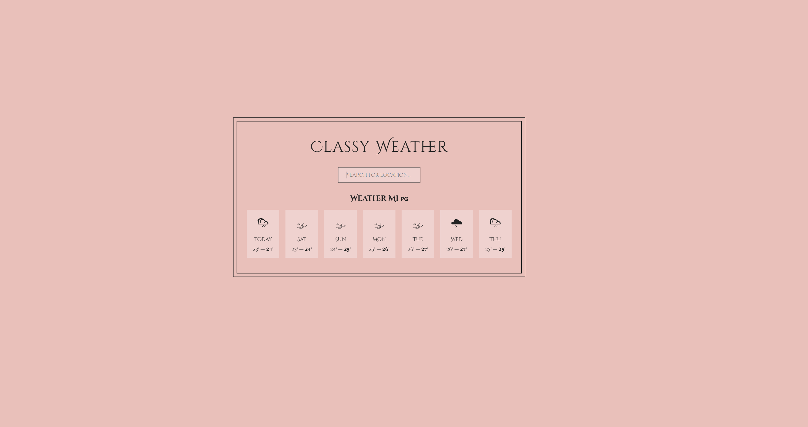
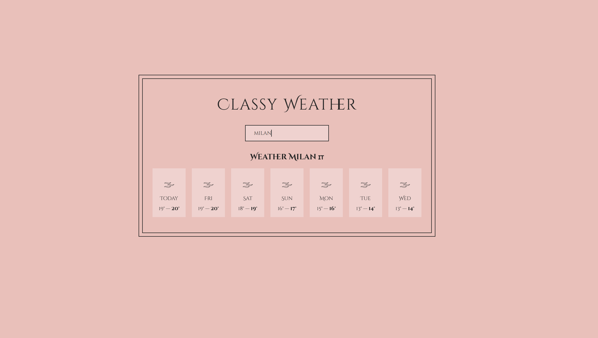

# classy-weather

**Disclaimer**: This project is based on the [The Ultimate React Course 2024: React, Next.js, Redux & More](https://www.udemy.com/course/the-ultimate-react-course/) Jonas Schmedtmann's course (project 2 from section Part 4: Intermediate React). The primary purpose of this repository is for personal learning and practice. All credit for the original design and concepts goes to Jonas Schmedtmann. This repository serves as my implementation of the project following the course.

## Overview
Welcome to the Classy Weather React App! This application provides a sleek and user-friendly interface for checking the weather forecast for the next 7 days. Simply enter the name of any town in the search bar, and you’ll receive an accurate and detailed weather report.

Features
7-Day Weather Forecast: Get a comprehensive weather outlook for the next week.
User-Friendly Design: Enjoy a clean and intuitive interface that makes checking the weather a breeze.
Town Search: Easily find the weather for any town by entering its name in the search bar.
Stay prepared and plan your week with confidence using the Classy Weather React App!

## Technologies Used
- React

## How to Run the Project
1. Install the packages
```
npm install
```
2. Run the application
```
npm start
```




